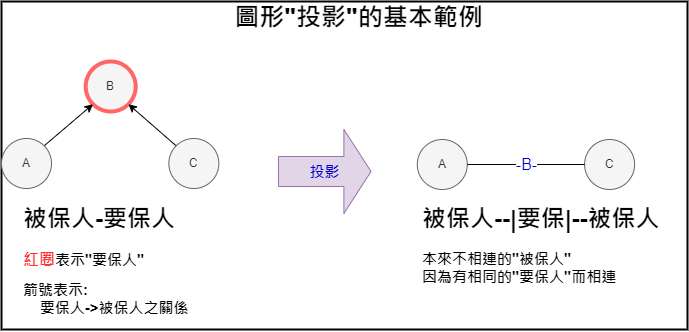
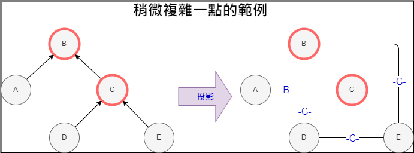

# 關聯客戶

找出有所關聯的被保人。方法有以下三種:
1. 直接連接: 彼此互為要保人v.s.被保人的關係。
2. 透過要保人連接: 彼此之間沒有直接連接，但擁有相同的要保人。
3. 透過標的物連接: 彼此之間沒有直接連接，但擁有相同的標的物。

## 筆記:
1. 有要保人從來沒有以被保人身分買過保單的; e.g. 5931a0575347fd7c392fc2dac8df3ac1e33ad03b

## 目前考慮:

1. 被保人
2. 要保人
3. 標的物

## 使用資料:

* 時間:
	2017/01/01 ~ 2022/03/31

* 險別:
	1. 車險(包含強制、任意)
	2. Hth(**不包含團傷**) 
	> note: 因主要目標是看關係，因此**包括防疫險**(同時為求一致，計算損率時也陪有排除防疫險)

## 關係:

1. 直接相連: 關係 = 要保人 v.s. 被保人
2. 透過要保人: 關係 = 被保人 v.s. 被保人 (兩者之間至少有一個相同要保人)
3. 透過標的物: 關係 = 被保人 v.s. 被保人 (兩者之間至少有一個相同標的物)

** 以上關係皆不分年 **
> 舉例來說: 結果中小明有10個(直接連接)關聯被保人，表示2017/01/01 ~ 2022/03/31中，他曾與10為被保人互為要保人-被保人


**圖例: 投影 (i.e. 透過某種關係間接相連)**




**圖例: 投影範例2**




---

## 結果:

詳細資料請見: 

- CSV格式: \\tp-fs2\數位發展中心\資料分享區\TmpData\關聯客戶\關聯客戶_prepared.csv
- parquet格式: \\tp-fs2\數位發展中心\資料分享區\TmpData\關聯客戶\關聯客戶_prepared.parq


### 直接連接Tops

請見num_original，此欄表示直接相連的客戶數

| index                                    |           plyAmt |           clmAmt |   ipolicy |   clmed_iply |   num_original |   num_byAppl |   num_byTag |   clm_rate |   clm_ratio |   plyAmt_直接連接 |   clmAmt_直接連接 |   ipolicy_直接連接 |   clmed_iply_直接連接 |   clm_rate_直接連接 |   clm_ratio_直接連接 |   plyAmt_通過標的物 |   clmAmt_通過標的物 |   ipolicy_通過標的物 |   clmed_iply_通過標的物 |   clm_rate_通過標的物 |   clm_ratio_通過標的物 |   plyAmt_通過要保 |   clmAmt_通過要保 |   ipolicy_通過要保 |   clmed_iply_通過要保 |   clm_rate_通過要保 |   clm_ratio_通過要保 |                                                                              
|:-----------------------------------------|-----------------:|-----------------:|----------:|-------------:|---------------:|-------------:|------------:|-----------:|------------:|------------------:|------------------:|-------------------:|----------------------:|--------------------:|---------------------:|--------------------:|--------------------:|---------------------:|------------------------:|----------------------:|-----------------------:|------------------:|------------------:|-------------------:|----------------------:|--------------------:|---------------------:|
| f38772d2ef20f8b414f656ea605bb640f400e45a |  14212           |      0           |       116 |            0 |           1150 |         1609 |           1 |   0        |   0         |       7.69403e+06 |       2.88564e+06 |              16215 |                    95 |            0.375049 |           0.00585877 |                   0 |                   0 |                    0 |                       0 |                   nan |                    nan |       1.21848e+07 |       7.37385e+06 |              18364 |                   143 |            0.60517  |           0.00778697 |
| 177e4401aa40fea73e52fb1e5640565a058816bb |   4794           |      0           |       102 |            0 |            732 |          804 |           1 |   0        |   0         |       4.55846e+06 |       1.33986e+06 |               1877 |                    56 |            0.293929 |           0.0298348  |                   0 |                   0 |                    0 |                       0 |                   nan |                    nan |       5.23337e+06 |       2.83131e+06 |               2177 |                    79 |            0.541011 |           0.0362885  |
| 839c5f0f86569b38b03e7937fc7fb1e3d184dda7 |   7380           |      0           |        60 |            0 |            717 |         1511 |           1 |   0        |   0         |       5.73445e+06 |  697823           |              14843 |                    30 |            0.12169  |           0.00202115 |                   0 |                   0 |                    0 |                       0 |                   nan |                    nan |       1.07332e+07 |       3.52882e+06 |              17800 |                   117 |            0.328775 |           0.00657303 |
| 72ab22475edcb0993d864ad16c7e6f072af77cfd |      1.05994e+06 |      4.34288e+06 |       215 |           15 |            654 |          683 |           1 |   4.09731  |   0.0697674 |       9.19632e+06 |       6.65887e+06 |               5094 |                    88 |            0.72408  |           0.0172752  |                   0 |                   0 |                    0 |                       0 |                   nan |                    nan |       9.62653e+06 |       6.65887e+06 |               5457 |                    88 |            0.691721 |           0.0161261  |
| ec226f51d671c12b4217658059c2e2e4ff09a84a |  42369           |  33000           |        39 |            3 |            439 |          461 |           2 |   0.778871 |   0.0769231 |       1.49862e+06 |  247492           |               1270 |                    18 |            0.165147 |           0.0141732  |              223115 |                   0 |                   20 |                       0 |                     0 |                      0 |       1.64889e+06 |  255192           |               1408 |                    23 |            0.154766 |           0.0163352  |
| 6261ce1fcd25c18ba3c6c0fb91991385e635ebcd | 531995           | 234610           |       400 |            5 |            414 |          507 |           2 |   0.441    |   0.0125    |       6.35487e+06 |       3.20405e+06 |              17594 |                    95 |            0.504188 |           0.00539957 |                1555 |                   0 |                    1 |                       0 |                     0 |                      0 |       8.85134e+06 |       3.90832e+06 |              18597 |                   128 |            0.441551 |           0.00688283 |
| 9c0e060cd3e2afb08d1dbab7d25fc252ba1b3023 | 115705           |      0           |       130 |            0 |            382 |         1479 |           1 |   0        |   0         |       4.91369e+06 |       4.89391e+06 |               3174 |                    71 |            0.995974 |           0.0223693  |                   0 |                   0 |                    0 |                       0 |                   nan |                    nan |       2.37778e+08 |       1.50946e+08 |              93427 |                  3031 |            0.634821 |           0.0324424  |
| de72b8c2264945edd12e4d0484757a9570ee8b0b |    244           |      0           |         2 |            0 |            380 |          800 |           1 |   0        |   0         |       2.73087e+06 |       1.38478e+06 |              10807 |                    24 |            0.507084 |           0.00222078 |                   0 |                   0 |                    0 |                       0 |                   nan |                    nan |       5.34016e+06 |       1.74616e+06 |              14271 |                    47 |            0.326987 |           0.00329339 |
| fb1c85ead831d8e2da3a0a1f3e6cd0a81c36d1df |   3360           |      0           |        88 |            0 |            379 |          408 |           1 |   0        |   0         |       4.49338e+06 |       1.57663e+06 |               4489 |                    64 |            0.350879 |           0.0142571  |                   0 |                   0 |                    0 |                       0 |                   nan |                    nan |       4.6269e+06  |       1.65363e+06 |               4660 |                    69 |            0.357395 |           0.0148069  |
| 9479835b33d0c6e9b21b58e91fa428c075096704 |    234           |      0           |         6 |            0 |            356 |          428 |           1 |   0        |   0         |       1.75763e+06 |  671157           |               1463 |                    23 |            0.381854 |           0.0157211  |                   0 |                   0 |                    0 |                       0 |                   nan |                    nan |       2.15337e+06 |  671157           |               1722 |                    23 |            0.311677 |           0.0133566  |

### 透過要保人相連

請見num_byAppl，此欄表示透過要保人相連的客戶數

note: 有超級要保人 (有超多關聯被保人):
```markdown
- 主要是旅平險?

2cc8727ff1528464ccb6f8e51ee2a397d8172464  個人旅行綜合保險          2234
                                          團體傷害保險乙型           447
                                          平安福個人旅行綜合保險        565
                                          旅行平安險             1456
                                          金如意團體傷害保險          515
c2757b6dafba37aec5b7b5da4a9a3eb632c6cbc9  平安御守個人旅行綜合保險      3003
                                          平安福個人旅行綜合保險       3257
                                          旅行平安險              373
                                          金如意團體傷害保險          492
```

| index                                    |   plyAmt |   clmAmt |   ipolicy |   clmed_iply |   num_original |   num_byAppl |   num_byTag |   clm_rate |   clm_ratio |   plyAmt_直接連接 |   clmAmt_直接連接 |   ipolicy_直接連接 |   clmed_iply_直接連接 |   clm_rate_直接連接 |   clm_ratio_直接連接 |   plyAmt_通過標的物 |   clmAmt_通過標的物 |   ipolicy_通過標的物 |   clmed_iply_通過標的物 |   clm_rate_通過標的物 |   clm_ratio_通過標的物 |   plyAmt_通過要保 |   clmAmt_通過要保 |   ipolicy_通過要保 |   clmed_iply_通過要保 |   clm_rate_通過要保 |   clm_ratio_通過要保 |
|:-----------------------------------------|---------:|---------:|----------:|-------------:|---------------:|-------------:|------------:|-----------:|------------:|------------------:|------------------:|-------------------:|----------------------:|--------------------:|---------------------:|--------------------:|--------------------:|---------------------:|------------------------:|----------------------:|-----------------------:|------------------:|------------------:|-------------------:|----------------------:|--------------------:|---------------------:|
| fb2a381b17af433e55f0f8ad4cd95bcdf17a3c6e |     1464 |        0 |        15 |            0 |              2 |         6746 |           1 |          0 |           0 |                 0 |                 0 |                  0 |                     0 |                 nan |                  nan |                   0 |                   0 |                    0 |                       0 |                   nan |                    nan |       1.31606e+08 |       9.14429e+07 |              82992 |                  1729 |            0.694823 |           0.0208333  |
| 01786dec9240c51dbd391570aea4d983504c877a |      418 |        0 |         4 |            0 |              2 |         6147 |           1 |          0 |           0 |                 0 |                 0 |                  0 |                     0 |                 nan |                  nan |                   0 |                   0 |                    0 |                       0 |                   nan |                    nan |       1.09343e+08 |       7.6318e+07  |              72978 |                  1481 |            0.69797  |           0.0202938  |
| f6fe65a3e247d1df422c7e74f7fef08520443dab |      236 |        0 |         4 |            0 |              2 |         5526 |           1 |          0 |           0 |                 0 |                 0 |                  0 |                     0 |                 nan |                  nan |                   0 |                   0 |                    0 |                       0 |                   nan |                    nan |       1.0071e+07  |       1.7069e+06  |              22647 |                    70 |            0.169487 |           0.00309092 |
| 17e754c774a3b2037d638c7f8a2467ef797f2b49 |     2520 |        0 |         6 |            0 |              2 |         5515 |           1 |          0 |           0 |                 0 |                 0 |                  0 |                     0 |                 nan |                  nan |                   0 |                   0 |                    0 |                       0 |                   nan |                    nan |       1.47753e+07 |       3.97787e+06 |              27029 |                   138 |            0.269223 |           0.00510563 |
| 4a4e3cc9bcc99d56eb12a629a7754c91549ec3c2 |      918 |        0 |        15 |            0 |              3 |         5514 |           1 |          0 |           0 |                 0 |                 0 |                  0 |                     0 |                 nan |                  nan |                   0 |                   0 |                    0 |                       0 |                   nan |                    nan |       1.74802e+07 |       7.8994e+06  |              25491 |                   140 |            0.451905 |           0.00549213 |
| c7cd103496ec8df62a2e4cc085fa1fbc693a198e |      630 |        0 |        15 |            0 |              3 |         5514 |           1 |          0 |           0 |                 0 |                 0 |                  0 |                     0 |                 nan |                  nan |                   0 |                   0 |                    0 |                       0 |                   nan |                    nan |       1.74805e+07 |       7.8994e+06  |              25491 |                   140 |            0.451898 |           0.00549213 |
| 573ca829002d41595432f1d9758005a8e39aca23 |     3039 |        0 |         9 |            0 |              2 |         5455 |           1 |          0 |           0 |                 0 |                 0 |                  0 |                     0 |                 nan |                  nan |                   0 |                   0 |                    0 |                       0 |                   nan |                    nan |       1.28542e+07 |       2.54278e+06 |              23966 |                   117 |            0.197817 |           0.00488192 |
| 08a8cb73d185b5d15886c048938a4a9baab0e9e9 |      626 |        0 |        18 |            0 |              2 |         5413 |           1 |          0 |           0 |                 0 |                 0 |                  0 |                     0 |                 nan |                  nan |                   0 |                   0 |                    0 |                       0 |                   nan |                    nan |       1.28145e+07 |       2.53648e+06 |              24448 |                   112 |            0.197938 |           0.00458115 |
| e95224c7fb0f6cc6b78eb695b6aae9dda6dfaa7a |     8001 |        0 |        30 |            0 |              2 |         5400 |           1 |          0 |           0 |                 0 |                 0 |                  0 |                     0 |                 nan |                  nan |                   0 |                   0 |                    0 |                       0 |                   nan |                    nan |       1.25942e+07 |       2.82648e+06 |              26473 |                   119 |            0.224427 |           0.00449515 |
| 944eba1ef85f67c6afc0d7c1b2a2665d66ff4095 |     7128 |        0 |        16 |            0 |              2 |         5338 |           1 |          0 |           0 |                 0 |                 0 |                  0 |                     0 |                 nan |                  nan |                   0 |                   0 |                    0 |                       0 |                   nan |                    nan |       1.27418e+07 |       2.53648e+06 |              23189 |                   112 |            0.199068 |           0.00482988 |


### 透過標的物相連

請見num_byTag，此欄表示透過標的物相連的客戶數

| index                                    |   plyAmt |   clmAmt |   ipolicy |   clmed_iply |   num_original |   num_byAppl |   num_byTag |   clm_rate |   clm_ratio |   plyAmt_直接連接 |   clmAmt_直接連接 |   ipolicy_直接連接 |   clmed_iply_直接連接 |   clm_rate_直接連接 |   clm_ratio_直接連接 |   plyAmt_通過標的物 |   clmAmt_通過標的物 |   ipolicy_通過標的物 |   clmed_iply_通過標的物 |   clm_rate_通過標的物 |   clm_ratio_通過標的物 |   plyAmt_通過要保 |   clmAmt_通過要保 |   ipolicy_通過要保 |   clmed_iply_通過要保 |   clm_rate_通過要保 |   clm_ratio_通過要保 |
|:-----------------------------------------|---------:|---------:|----------:|-------------:|---------------:|-------------:|------------:|-----------:|------------:|------------------:|------------------:|-------------------:|----------------------:|--------------------:|---------------------:|--------------------:|--------------------:|---------------------:|------------------------:|----------------------:|-----------------------:|------------------:|------------------:|-------------------:|----------------------:|--------------------:|---------------------:|
| e5b96592ae8e9bc0a179d2644e24fdb4353fcc40 |   296235 |        0 |        40 |            0 |              1 |            1 |          19 |     0      |    0        |                 0 |                 0 |                  0 |                     0 |           nan       |           nan        |    996479           |    394419           |                  627 |                      19 |              0.395813 |              0.030303  |                 0 |                 0 |                  0 |                     0 |           nan       |           nan        |
| 1cf4905d6b42b4bc359d0a37ef0f633d0fea54c9 |     5880 |        0 |         6 |            0 |              1 |            1 |          17 |     0      |    0        |                 0 |                 0 |                  0 |                     0 |           nan       |           nan        |    481981           |    782952           |                  143 |                      12 |              1.62445  |              0.0839161 |                 0 |                 0 |                  0 |                     0 |           nan       |           nan        |
| d69004d76503004aaf1a3d192f2e4fce323725c8 |    42862 |        0 |         6 |            0 |              2 |            2 |          14 |     0      |    0        |            641470 |                 0 |                 95 |                     0 |             0       |             0        |    734198           |    179300           |                  340 |                       9 |              0.244212 |              0.0264706 |            641470 |                 0 |                 95 |                     0 |             0       |             0        |
| 594761876024a6a16ec41401ecc8fc56f1f4e86d |   116520 |        0 |        40 |            0 |              1 |            1 |          13 |     0      |    0        |                 0 |                 0 |                  0 |                     0 |           nan       |           nan        |         0           |         0           |                    0 |                       0 |            nan        |            nan         |                 0 |                 0 |                  0 |                     0 |           nan       |           nan        |
| 6ceba27eb5cd4253fa077f2ad075a9002d2c7e73 |    83480 |        0 |        60 |            0 |              3 |            3 |          13 |     0      |    0        |             47868 |                 0 |                 20 |                     0 |             0       |             0        |    423720           |         1.76942e+06 |                   79 |                       8 |              4.17591  |              0.101266  |             47868 |                 0 |                 20 |                     0 |             0       |             0        |
| b244ff331370d045c1ae27696bc3954c71d0f5d7 |   133240 |        0 |        50 |            0 |              4 |            4 |          13 |     0      |    0        |            337855 |            544095 |                 35 |                    10 |             1.61044 |             0.285714 |         1.13612e+06 |    222493           |                  214 |                      13 |              0.195835 |              0.0607477 |            337855 |            544095 |                 35 |                    10 |             1.61044 |             0.285714 |
| 73614988b08f8c327caa7c289a7f0cd748ba2c03 |   222740 |        0 |        40 |            0 |              1 |            1 |          12 |     0      |    0        |                 0 |                 0 |                  0 |                     0 |           nan       |           nan        |    257683           |     73880           |                   70 |                       2 |              0.286709 |              0.0285714 |                 0 |                 0 |                  0 |                     0 |           nan       |           nan        |
| d29f63cf6b16de210c02608180c94f620f4e9ad3 |   126714 |        0 |        15 |            0 |              1 |            1 |          12 |     0      |    0        |                 0 |                 0 |                  0 |                     0 |           nan       |           nan        |    227476           |     28400           |                   36 |                       2 |              0.124848 |              0.0555556 |                 0 |                 0 |                  0 |                     0 |           nan       |           nan        |
| 740657d5b2b2d2af2ea279bef3ac990c96ac13bf |    80645 |   118500 |        35 |            5 |              1 |            1 |          11 |     1.4694 |    0.142857 |                 0 |                 0 |                  0 |                     0 |           nan       |           nan        |    452584           |         0           |                   94 |                       0 |              0        |              0         |                 0 |                 0 |                  0 |                     0 |           nan       |           nan        |
| 310d5a8dac35d451e9fbf7c0ae467352ad970361 |     6226 |        0 |         2 |            0 |              1 |            1 |          11 |     0      |    0        |                 0 |                 0 |                  0 |                     0 |           nan       |           nan        |     53710           |         0           |                   33 |                       0 |              0        |              0         |                 0 |                 0 |                  0 |                     0 |           nan       |           nan        |

